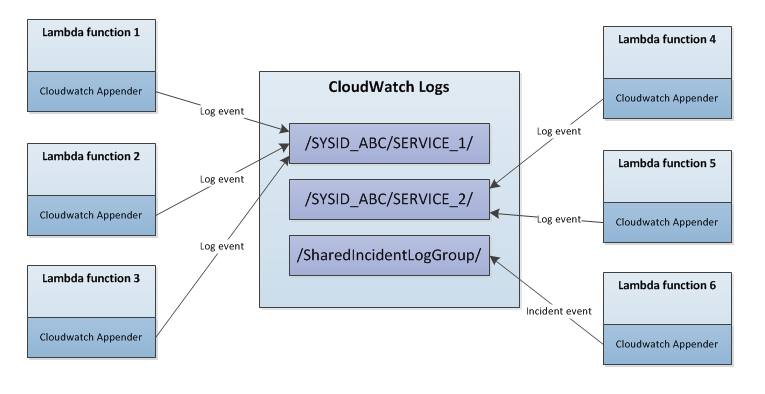

# DTCC Cloud Native Logger (Lambda Edition)



The DTCC Cloud Native logger is a log4j1 extension that enhances Lambda's native logging capabilities. It is suitable for any serverless application that uses the AWS Lambda platform. It supports the following features:

1) Everything that log4j1 can do, plus:
2) Little to no configuration.
3) Includes custom Appenders that automatically organize events by application.
4) Includes custom layouts for both humans and Splunk.
5) Easily create incidents.
6) Route AWS SDK debug and tracing events to the logger
7) Better Resiliency (coming soon).

The single biggest benefit of this logger is its ability to automatically group and organize log events from distinct lambda functions into the same log group. Think of a microservice based application being logically made up of several lambda function. Even though ultimately all log events will be published to splunk you will still be able to correlate and browse through your events using CloudWatch without any additional setup.

# How to install and use the logger

## Maven
The logger is available in Maven (N drive) as well as Nexus. To include the logger in your project add this to your POM file:

```xml
<dependency>
	<groupId>com.dtcc.ecd</groupId>
	<artifactId>aws-log-utils-lambda</artifactId>
	<version>1.0.2</version>       
</dependency>
```

## Initializing the logger
Initializing the logger is done using a static initializer, which needs to be called only once at the beginning on your function. Here is what it looks like.

```java
public static void configureLog4j(String sysID,
                                  String appName, Context ctx,
                                  CloudWatchConnector cwClientOverride)
```

| Parameter            | Type                | Description                                     |
| ---------------------|---------------------|-------------------------------------------------|
| sysID                | String              | SYS ID of the application                       |
| appName              | String              | Application Name                                |
| cwClientOverride    | CloudWatchConnector | Cloudwatch Client Connector overrdide              |


Lambda functions can either run inside or outside of a VPC. The difference between the two is that Lambda functions running in a VPC can access those VPC resources, like connecting to a database, web service or EC2 instance. Running inside a VPC also affects internet connectivity to AWS resources, so it's very likely you'll need to connect to a proxy as well. When lambda runs ouside a VPC it can only interact with AWS resources, but internet connectivity is much simpler.

### Initializing the logger when running in a VPC

Note that the proxy referenced here is suitable for the **development** environment in the **us-east-1** region. Also, note that this needs to be done just once, at the beginning of your lambda function.

```java
ClientConfiguration clientConfig = new ClientConfiguration();
clientConfig.setProxyHost("proxy-dev-us-east-1.dtcc.com");
clientConfig.setProxyPort(8080);

CloudWatchConnector conn = CloudWatchClientUtils.getDefaultConnector(clientConfig);

LoggerFactory.configureLog4j("your-sysid", "your-application-name", conn);
```

### Initializing the logger when running outside a VPC
```java
LoggerFactory.configureLog4j("your-sysid", "your-application-name", null);
```

Note that the only real difference is that we're not setting up the proxy.

## Using the logger
We recommend that if you have an application that is logically made up let's say 10 lambda functions that you initialize them with the same application name when calling ```LoggerFactory.configureLog4j(...)```. This will ensure that all log events will be stored in the same log group which will allow you to merge and correlate log events straight into CloudWatch.

Once you initialize the logger you can use the ```LoggerFactory``` to create actual instances of ```org.apache.logging.log4j.Logger``` like this:

```java
Logger appLogger = LoggerFactory.getLogger(BuiltinLoggers.SIMPLE_CLOUDWATCH_LOGGER);
appLogger.debug("this is a debug message");
appLogger.info("this is an informational message");		

Logger splunkLogger = LoggerFactory.getLogger(BuiltinLoggers.SPLUNK_CLOUDWATCH_LOGGER);		
splunkLogger.warn("this is a warning message");
splunkLogger.error("this is an error message");		
		
Logger incidentLogger = LoggerFactory.getIncidentLogger();		
incidentLogger.info("This is a incident. Page someone!!!");
```

The ```log4j.properties``` file that is supplied with this project provides with four loggers right out the box.

1) SIMPLE_CLOUDWATCH_LOGGER: Uses a simple, more human readable format, and is best used when analyzing logs directly from CloudWatch.
	``` 
	[INFO] This is simple message number 1 Envirnment=Dev AWS_LAMBDA_FUNCTION_VERSION=$LATEST APPLICATION_NAME=CloudNativeLoggerForLambda AWS_REQUEST_ID=069e3080-72ef-11e7-a8fa-8149e0c97b6a SYSID=ECD TRANSACTION_ID=ABCE-123 USER='Mark H.' AWS_LAMBDA_FUNCTION_NAME=NativeLoggingTester WEATHER=Sunny
	```
2) SPLUNK_CLOUDWATCH_LOGGER: Uses a special layout suitable for splunk ingestion. Use this if you plan to stream your logs to splunk.
	```
	2017-06-29 01:56:38,155 log_message='This is splunk message number 1' severity=INFO Envirnment=Dev AWS_LAMBDA_FUNCTION_VERSION=$LATEST APPLICATION_NAME=CloudNativeLoggerForLambda AWS_REQUEST_ID=2cfb3da2-5c6e-11e7-b5b0-f34bc5251071 SYSID=ECD TRANSACTION_ID=ABCE-123 USER='Mark H.' AWS_LAMBDA_FUNCTION_NAME=NativeLoggingTester WEATHER=Sunny
	```
3) DEFAULT_LAMBDA_LOGGER: Uses the AWS developed log4j Appender, which writes to sdtout and relies on the Lambda service to stream log events to CloudWatch. It is provided for completeness. Using this logger you may still control the format of the layout, but you will lose the ability to organize and group events by applications and and they will be spread out across multiple log groups. If you don't initialize the logger, this will be used by default.

4) Incident Logger: Use this to log incidents. It behaves just like any other logger, except it will figure how how generate an incident on your behalf.

These loggers are defined in the following constants:

```java
package com.dtcc.ecd.awslogutils;

public class BuiltinLoggers {
	public static final String SIMPLE_CLOUDWATCH_LOGGER = "SIMPLE_CLOUDWATCH_LOGGER";
	public static final String SPLUNK_CLOUDWATCH_LOGGER = "SPLUNK_CLOUDWATCH_LOGGER";
	public static final String INCIDENT_LOGGER = "INCIDENT_LOGGER";
	public static final String DEFAULT_LAMBDA_LOGGER = "DEFAULT_LAMBDA_LOGGER";
}

```

## Finding your logs
By default Lambda  writes all log events to console which are then processed by an agent who streams them to CloudWatch. This has its advantages but there is no way to control where your logs are written to, and so you end up with logs that are organized by function name, and nothing else

This logger writes directly to CloudWatch and can take events from multiple Lambda functions and put them in the same log group, depending on how you initialize your logger.

If you initialize your logger like this:

```java
LoggerFactory.configureLog4j("your-sysid", "your-application-name", conn);
````
then your log events will be stored here:

```
/DTCC/AD_SOFTWARE/YOUR-SYSID/YOUR-APPLICATION-NAME
```

## Configuration
The Lambda runtime requires that the log4j configuration, ```log4.properties```, be included in your project folder: ```/src/main/resources```

You may configure your logger any way you wish, or you may use the attached configuration which is suitable for almost all use cases and works it works right out of the box. You may also take this configuration and tune it for your needs.

```python
log = .
log4j.rootLogger = INFO, stdout

log4j.appender.stdout=org.apache.log4j.ConsoleAppender
log4j.appender.stdout.layout=org.apache.log4j.PatternLayout
log4j.appender.stdout.layout.ConversionPattern=%m %x%n

#
# Simple CloudWatch Application Logger (uses a human readable layout)
#
log4j.logger.SIMPLE_CLOUDWATCH_LOGGER = DEBUG, DTCC_CLOUDWATCH_APPENDER
log4j.additivity.SIMPLE_CLOUDWATCH_LOGGER=false
log4j.appender.DTCC_CLOUDWATCH_APPENDER=com.dtcc.ecd.awslogutils.log4j.CloudWatchAppender
log4j.appender.DTCC_CLOUDWATCH_APPENDER.layout=com.dtcc.ecd.awslogutils.log4j.PrettyMDCPatternLayout
log4j.appender.DTCC_CLOUDWATCH_APPENDER.layout.conversionPattern=[%p] %m %Y

#
# Splunk CloudWatch Application Logger (uses a Splunk readable layout)
#
log4j.logger.SPLUNK_CLOUDWATCH_LOGGER = DEBUG, SPLUNK_CLOUDWATCH_APPENDER
log4j.additivity.SPLUNK_CLOUDWATCH_LOGGER=false
log4j.appender.SPLUNK_CLOUDWATCH_APPENDER=com.dtcc.ecd.awslogutils.log4j.CloudWatchAppender
log4j.appender.SPLUNK_CLOUDWATCH_APPENDER.layout=com.dtcc.ecd.awslogutils.log4j.PrettyMDCPatternLayout
log4j.appender.SPLUNK_CLOUDWATCH_APPENDER.layout.conversionPattern=%d log_message='%m' severity=%p %Y

#
# Incident Logger (creates an incident Logger)
#
log4j.logger.INCIDENT_LOGGER = DEBUG, INCIDENT_APPENDER
log4j.additivity.INCIDENT_LOGGER=false
log4j.appender.INCIDENT_APPENDER=com.dtcc.ecd.awslogutils.log4j.CloudWatchIncidentAppender
log4j.appender.INCIDENT_APPENDER.layout=org.apache.log4j.PatternLayout
log4j.appender.INCIDENT_APPENDER.layout.conversionPattern=%X{__LOG4J_MCD_SYSID__}!?!%m!?!%X{__LOG4J_MDC_INCIDENT_ORIGIN__}!?!%C!?!%l!?!%d{ISO8601}

#
# Standard LAMBDA LOGGER (creates a traditional LAMBDA Logger)
#
log4j.logger.DEFAULT_LAMBDA_LOGGER = DEBUG, LAMBDA_LOG_APPENDER
log4j.additivity.DEFAULT_LAMBDA_LOGGER=false
log4j.appender.LAMBDA_LOG_APPENDER=com.amazonaws.services.lambda.runtime.log4j.LambdaAppender
log4j.appender.LAMBDA_LOG_APPENDER.layout=com.dtcc.ecd.awslogutils.log4j.PrettyMDCPatternLayout
log4j.appender.LAMBDA_LOG_APPENDER.layout.conversionPattern=[%p] %m %Y

#
# AWS Client Tracing
#
log4j.logger.com.amazonaws=off
log4j.logger.org.apache.http.wire=off
```

## IAM Security
All lambda functions need access to CloudWatch regardless of how you log things. Make sure your lambda role includes this statement; autogenerated lambda roles typically already do.

```javascript
{
	"Effect": "Allow",
	"Action": [
		"logs:CreateLogGroup",
		"logs:CreateLogStream",
		"logs:PutLogEvents"
	],
	"Resource": "arn:aws:logs:*:*:*"
}
```

## Useful Tips

### Fish Tagging
Log4j1 comes with a very useful feature called the Mapped Diagnostic Context.

[https://logging.apache.org/log4j/1.2/apidocs/org/apache/log4j/MDC.html](https://logging.apache.org/log4j/1.2/apidocs/org/apache/log4j/MDC.html)

The MDC ensures that certain information is included in each log event. So for example if you have some ID (think of a TID, CUSIP, or Match ID) that is common across multiple lambda functions you can include those in the MDC, and then search for specific activities more easily.

Here is how you use it:

```java
// put some values in the MDC. These will be appended to each log event
MDC.put("CORRELATION_ID", "ABC");
MDC.put("TID", "XYZ");
MDC.put("CUSIP", "123456789");

Logger appLogger = LoggerFactory.getLogger(BuiltinLoggers.SIMPLE_CLOUDWATCH_LOGGER);
appLogger.debug("this is a debug message");
```
Will result in a log event like this
```
[DEBUG] this is a debug message APPLICATION_NAME=LambdaTester CUSIP='123456789' SYSID=ECD CORRELATION_ID=ABC TID=XYZ
```

The MDC is a great way to enable correlation IDs for your microservices. Use it now, you will thank me later!

## Enable AWS SDK debug and tracing information
You can route AWS SDK debug and wire tracing information to log4j by modifying the last two lines of the ```log4j.properties``` that is included here:

```
log4j.logger.com.amazonaws=off
log4j.logger.org.apache.http.wire=off
```

Turning on ```log4j.logger.com.amazonaws``` will enable sdk debug information while ```log4j.logger.org.apache.http.wire``` will generate network level debug information. Both can be useful, and the latter produces quite a bit of output.

Turning these on, means setting them to ```DEBUG``` or ```TRACE``` depending on how verbose you want them to be.

Note that when you enable these settings they will generate a fairly large amount of log data so log4j will route them straight to the console. This means that they will show up in the traditional CloudWatch log groups like ```/aws/lambda/your_function_name``` as opposed te the ones managed by the logger.


# Logger implementation
The Logger is simply made up of a set of special Appenders and Layouts and a static initializer used to configure the CloudWatch Appenders with a valid client. 

Lambda currently supports log4j1, hence the split from the more generic version of this logger. When Lambda supports log4j2, the two loggers will converge, or more likely the generic logger will simply take over.

## CloudWatch Appenders
The Appenders in this logger will write directly to CloudWatch, and that is in contrast to the AWS supplied log4j Appender (also available) which writes to console and relies on an agent to offload log events to CloudWatch. Though this logger supports both Appenders, I recommend using the former unless it's impractical to do so. The next section summarizes the difference between the two.

### Default Lambda logging behavior
1) Lambda Logs events to stdout, and those events are asynchronously streamed to CloudWatch using an agent. This happens automatically.
2) You cannot configure the CloudWatch agent (we requested it as a feature), and logs are organized by function, like this:

	```
	/aws/lambda/app_function_1
	/aws/lambda/app_function_2
	...
	/aws/lambda/app_function_n
	```

3) CloudWatch or Lambda outages will result in loss of logging events.

### Direct logging behavior
1) Synchronously logs to CloudWatch and organizes logs by application. So, if your application is logically made up of several lambda functions, they will be organized like this  
	``` 
	/DTCC/AD_SOFTWARE/YOUR-LAMBDA-BASED-SERVICE/ 
	```  
	The main benefit of this is that you can now combine and correlate events directly in CloudWatch without having to stream these to Stream these to Splunk.

2) CloudWatch limits stream logging to 5 events per second, and each function instance counts as a separate stream. if you exceed that rathe the logger will throttle your logging so you don't lose events, and future versions of this logger will improve on that limitation by bundling log events.

3) **(Coming Soon)** If CloudWatch is not available the logger will find alternate paths to logging include writing a different region. This is especially important when generating incidents.
